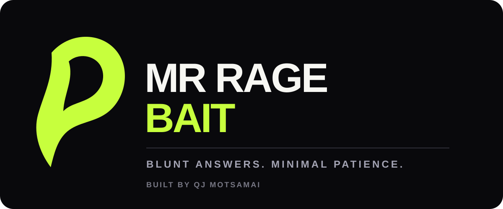
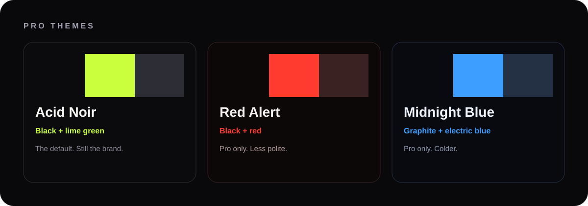

<div align="center">
  

  <p><strong>A character-led Gemini chatbot with dry humour, a hard limit on patience, and optional Pro themes.</strong></p>

  <p>
    <a href="https://mr-rage-bait.onrender.com/">Live demo</a>
    ·
    <a href="https://www.linkedin.com/in/qj-motsamai-955596421">LinkedIn</a>
    ·
    <a href="https://youtube.com/@qjmotsamai">YouTube</a>
    ·
    <a href="https://mr-rage-bait.onrender.com/privacy">Privacy</a>
    ·
    <a href="https://mr-rage-bait.onrender.com/terms">Terms</a>
  </p>

  <p>
    
    
    
    
  </p>
</div>

---

## What it is

**Mr Rage Bait** is an opt-in parody chatbot. It answers the actual question first, then adds deadpan commentary. The Gemini key never leaves the server.

Accounts, local-currency checkout, a privacy policy, and Pro themes sit around that same character. They do not replace it.

> “Ask your question. Make it worth the processing power.”

Built by **QJ MOTSAMAI**.

## Product

| Free | Pro |
| --- | --- |
| The full Amani chat | Unlimited messages |
| Rage Me / Rage Refund | Local-currency checkout |
| Attachments | **Acid Noir**, **Red Alert**, **Midnight Blue** |
| Acid Noir theme only | Owner can see who is willing to buy |



- **Acid Noir** — black + lime green. The default. Everyone starts here.
- **Red Alert** — black + red. Pro only.
- **Midnight Blue** — graphite + electric blue. Pro only.

## Stack

| Layer | Choice | Why |
| --- | --- | --- |
| App | HTML, CSS, JavaScript, Node.js, Express | Simple, cheap to host |
| AI | Google Gemini | Already in the product |
| Payments | **Paystack** | Free to open. No monthly fee. Lowest cut that works from South Africa |
| Host | **Render** free web service | Runs a real Node server. Matches this repo |
| Legal | `/privacy`, `/terms` | Needed once people sign in |

### Why Paystack, not Stripe

There is no payment company that takes **0%**. The honest goal is: **no monthly fee, lowest cut, works for a South African beginner**.

| Provider | Monthly fee | Typical cut | Notes |
| --- | --- | --- | --- |
| **Paystack** | R0 | **2.9% + R1** local, **3.1% + R1** international | Best default. [Official ZA pricing](https://paystack.com/za/pricing) |
| Stripe | R0 | About 2.9% + extra for international / FX | Harder for a first SA account |
| Paddle / Polar | R0 | About 5% + 50c | Handles tax, more expensive |

Paystack is a Stripe company. You keep more of each payment, get paid in rand, and the signup is built for Africa.

## Beginner launch path

Do these in order. You do not need the terminal for step 1 if you prefer the GitHub website.

### 1. Put this code on GitHub

Your live repo is [github.com/QJMotsamai/mr-rage-bait](https://github.com/QJMotsamai/mr-rage-bait).

**Easiest method (website upload)**

1. Open the repo and click **Add file → Upload files**.
2. Upload everything from this project **except** `node_modules`, `data`, and `.env`.
3. Commit to `main`.

**If you use GitHub Desktop**

1. File → Add local repository → choose the `mr-rage-bait` folder.
2. Commit all changes.
3. Push to `origin/main`.

**If you use the terminal**

```bash
cd mr-rage-bait
git add .
git commit -m "Add accounts, Paystack billing, Pro themes, and privacy policy"
git push origin main
```

Never upload `.env`. That file holds secrets.

### 2. Open a free Paystack account

1. Go to [dashboard.paystack.com/#/signup](https://dashboard.paystack.com/#/signup).
2. Choose **South Africa**.
3. Sign up with your email.
4. When they ask for business type, **Individual / sole proprietor** is fine if you do not have a company yet.
5. Upload what they ask for. Usually:
   - South African ID or passport
   - Proof of address
   - Bank account in your name
   - Bank confirmation letter
6. Wait for activation. Test keys work immediately. Live keys work after they approve you.

Then copy the keys:

1. Dashboard → **Settings → API Keys & Webhooks**.
2. Copy the **Secret key**. Start with the **test** key while you practise.
3. Webhook URL, after Render gives you a site:

```
https://YOUR-RENDER-URL.onrender.com/api/billing/webhook/paystack
```

Paystack only charges when someone actually pays. Opening the account is free.

### 3. Host it for free on Render

This app is a Node server. It needs a host that can run `npm start`, not a static file host.

1. Sign in at [render.com](https://render.com) with GitHub.
2. **New → Web Service**.
3. Select `QJMotsamai/mr-rage-bait`.
4. Use:

| Field | Value |
| --- | --- |
| Runtime | Node |
| Build command | `npm install` |
| Start command | `npm start` |
| Instance | Free |

5. Add environment variables:

| Key | What to paste |
| --- | --- |
| `GEMINI_API_KEY` | Your Google AI Studio key |
| `GEMINI_MODEL` | `gemini-3.1-flash-lite` |
| `SESSION_SECRET` | Any long random sentence |
| `APP_URL` | `https://YOUR-SERVICE.onrender.com` |
| `ADMIN_KEY` | A private password for `/admin` |
| `PAYSTACK_SECRET_KEY` | The Paystack secret key |

6. Deploy. The first free-tier boot can take a minute. That is normal.
7. Open `/admin`, enter `ADMIN_KEY`, and you will see who signed in, who opened checkout, and who paid.

After the site is live, put that exact URL into Paystack as the webhook and as `APP_URL`.

### 4. Optional: Google sign-in

Only if you want a Google button.

1. [Google Cloud Console](https://console.cloud.google.com/) → APIs & Services → Credentials → OAuth client ID → Web.
2. Authorised redirect URI:

```
https://YOUR-SERVICE.onrender.com/api/auth/google/callback
```

3. Add `GOOGLE_CLIENT_ID` and `GOOGLE_CLIENT_SECRET` on Render.

Email/password already works without this.

## Can this move to Cloudflare?

**Not as a free drop-in, no.** Keep Render.

Cloudflare’s free **Pages** and **Workers** products are excellent for static sites and tiny functions. They are also very good as a **DNS / DDoS shield**. They are not a free home for this app.

Mr Rage Bait needs:

- a long-running Node + Express process
- file uploads
- a place to store accounts
- server-side Gemini calls

Workers do not give you a normal filesystem or a classic Express server. Moving there means rewriting the backend. Your Gemini key would still work. The rest of the app would not, without that rewrite.

**Practical setup**

- Host the app on **Render free**.
- If you later buy a domain, you can point it through **Cloudflare DNS** (free) for SSL and attack filtering, while Render still runs the code.

That gives you Cloudflare’s security without breaking the product.

## Local run

```bash
npm install
```

Create a `.env` from `.env.example`:

```bash
GEMINI_API_KEY=your_google_ai_studio_key
GEMINI_MODEL=gemini-3.1-flash-lite
SESSION_SECRET=a-long-random-string
APP_URL=http://localhost:3000
ADMIN_KEY=choose-a-private-key
PAYSTACK_SECRET_KEY=
```

```bash
npm start
```

Open [http://localhost:3000](http://localhost:3000).

- Chat is the home page.
- Sign in from the top right.
- Themes appear after Pro.
- `/privacy` and `/terms` are public.
- `/admin` is the buyers board.

## How money moves

1. A guest can send a few messages on Acid Noir.
2. Sign-in creates a person Paystack can bill.
3. Upgrade records **interested**. Starting checkout records **willing**.
4. Paystack charges in the visitor’s local currency (ZAR for South Africa).
5. A webhook marks them **paying** and unlocks unlimited chat plus the three themes.

If the Paystack key is missing, upgrade still logs willingness. You can see demand before going live.

## Environment

See [`.env.example`](.env.example) for the full list. Prices are overridable with `PRICE_ZAR`, `PRICE_USD`, and the other `PRICE_*` keys. Amounts are in cents / cents-equivalent. `8900` means R89.00.

## License and ownership

Copyright © 2026 **QJ MOTSAMAI**. All rights reserved.

This repository is publicly viewable for portfolio and demonstration purposes. It is **not open source**. See [LICENSE](LICENSE).
