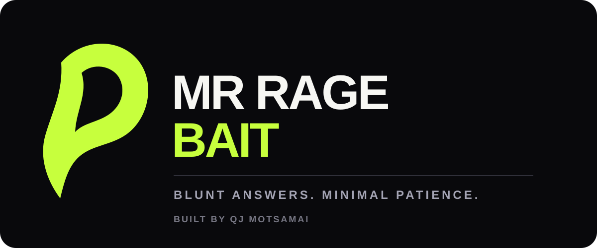
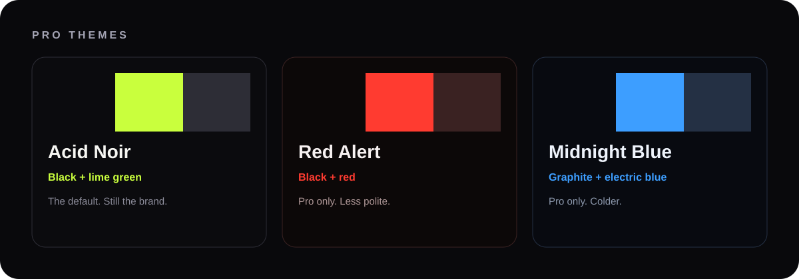

  

  
<strong>A character-led Gemini chatbot with dry humour, a hard limit on patience, and optional Pro themes.</strong>

  

    <a href="https://mr-rage-bait.onrender.com/">Live demo</a>
    ·
    <a href="https://www.linkedin.com/in/qj-motsamai-955596421">LinkedIn</a>
    ·
    <a href="https://youtube.com/@qjmotsamai">YouTube</a>
    ·
    <a href="https://mr-rage-bait.onrender.com/privacy">Privacy</a>
    ·
    <a href="https://mr-rage-bait.onrender.com/terms">Terms</a>
  

  

    
    
    
    
    
  

---

## What it is

**Mr Rage Bait** is an opt-in parody chatbot. It answers the actual question first, then adds deadpan commentary. Never cruel, never a slur, never punching down — it sets a dry boundary and gets back to being useful.

> “Ask your question. Make it worth the processing power.”

Behind the character sits a complete small product: accounts, a daily free allowance, a R35 once-off 30-day pass, five themes, a privacy policy, and an owner's view of who is actually willing to pay.

Built by **QJ MOTSAMAI**.

## Product

| Free | Pro — R35 once-off |
| --- | --- |
| The full Amani chat | Unlimited messages for 30 days |
| Rage Me / Rage Refund | All five themes |
| Attachments — image, TXT, DOCX | The full cast: Amani, Zola, Neo |
| Acid Noir theme | Renew any time — passes stack |

- **Acid Noir** — black + lime. The default. Everyone starts here.
- **Red Alert** — black + red. Pro only.
- **Midnight Blue** — graphite + electric blue. Pro only.
- **Rose Riot** — pink and loud. Pro only.
- **High Voltage** — hazard tape energy. Pro only.

## Stack

| Layer | Choice |
| --- | --- |
| App | Node.js + Express, vanilla HTML/CSS/JS — no build step |
| AI | Groq (Llama 3.1 8B Instant) with automatic Google Gemini fallback |
| Payments | Yoco Checkout — ZAR only, free to set up, made for South Africa |
| Data | PostgreSQL on Neon, with a JSON-file fallback for local work |
| Host | Render |

No front-end framework and no bundler. The whole client is four static pages.

## How it works

The browser never sees a key. Every model call is proxied by the server, so `GROQ_API_KEY` and `GEMINI_API_KEY` stay server-side.

Text chat goes to **Groq** first (`llama-3.1-8b-instant`, ~14,400 free requests/day, replies in a blink). If Groq is down or rate-limited, the same request is retried on **Gemini 3.5 Flash Lite** silently. Images and very long documents skip Groq entirely and go straight to Gemini — the free Groq text models have no vision, and a 30,000-character document can eat its whole per-minute token budget in one shot.

Sessions are random tokens; only a SHA-256 hash is stored. Passwords use `scrypt` with a per-user salt and are compared in constant time.

Payment webhooks are verified before they are trusted — the raw body is checked against an HMAC-SHA256 signature with a three-minute replay window, so a forged "they paid" request is rejected.

State lives in Postgres but is cached in memory and written back on change, which keeps every read instant and the whole storage layer swappable. If the database is unreachable the app logs it, falls back to local storage, and stays online rather than crashing.

## How money moves

1. A guest gets a few messages. Signing in raises the daily allowance.
2. Opening Upgrade records **interested**. Starting checkout records **willing**.
3. Yoco charges **R35 once-off** in rand. International cards work; the user's bank does the conversion.
4. A verified `payment.succeeded` webhook credits a **30-day pass** and unlocks unlimited chat, the themes and the cast. When the pass ends the account drops back to free on its own. Buying again stacks another 30 days on whatever is left — there is no subscription and nothing to cancel.

If no payment key is configured, upgrade clicks still record willingness — so demand is measurable before the money is switched on.

## Deploying (Render + Neon)

1. **Neon**: create a free project, copy the **pooled** connection string (the host with `-pooler` in it) into Render's `DATABASE_URL`.
2. **Render**: create a Web Service from this repo (or use `render.yaml`). Set the env vars below. The free plan sleeps after 15 idle minutes and Neon suspends after five — the first request after a pause just takes a few extra seconds.
3. **Yoco**: in the Yoco portal (Selling Online → Payment Gateway → Webhooks) point `payment.succeeded` (and the two refund events) at `https://YOUR-APP.onrender.com/api/billing/webhook/yoco`.

| Env var | What it is |
| --- | --- |
| `GROQ_API_KEY` | Free key from console.groq.com/keys — the main brain |
| `GEMINI_API_KEY` | Free Google AI Studio key — the fallback brain |
| `YOCO_SECRET_KEY` | `sk_live_…` from the Yoco developer settings |
| `YOCO_WEBHOOK_SECRET` | `whsec_…` shown when you create the webhook |
| `DATABASE_URL` | Neon pooled Postgres connection string |
| `APP_URL` | The public URL, e.g. `https://mr-rage-bait.onrender.com` |
| `ADMIN_KEY`, `SESSION_SECRET`, `GOOGLE_CLIENT_*` | As before — admin access, sessions, Google sign-in |

## License and ownership

Copyright © 2026 **QJ MOTSAMAI**. All rights reserved.

This repository is publicly viewable for portfolio and demonstration purposes. It is **not open source**. See [LICENSE](LICENSE).
